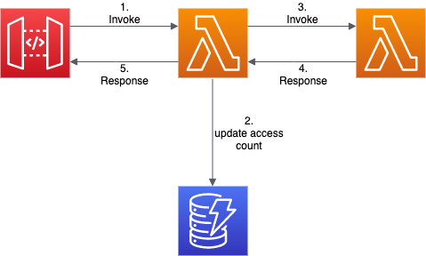
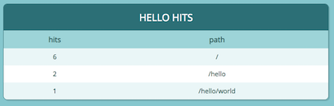

Terraform や CloudFromtaion といったインフラ管理ツールと比較してどうなのかなと気になっていた、AWS CDK のワークショップを見つけたのでやってみた。
https://cdkworkshop.com/

# aws cdk について

https://aws.amazon.com/jp/cdk/

```
AWS クラウド開発キット (AWS CDK) は、使い慣れたプログラミング言語を使用して
クラウドアプリケーションリソースをモデル化およびプロビジョニングするためのオープンソースのソフトウェア開発フレームワークです。
```

ということで普段から Terraform,CloudFormation バリバリ書いてます！という人より、普段プログラミングをしている開発者が、自分の得意な言語でそのまま地続きで AWS に手が出せるというのがメリットのようだ。
そういう意味だと私は前者なのでこのツールのターゲット外な気もするが、そういった人からみたこのツールのメリットデメリットもあげられればと思う。

# API Gateway + Lambda + DynamoDB でアクセスカウンタを作る。

https://cdkworkshop.com/20-typescript/40-hit-counter.html

初めのチュートリアルは、サンプル通りに動かして SQS,SNS ができるだけなので割愛。  
また、詳細な手順はワークショップを見ればわかるので、ここでは書かない。

この章では以下のようなサーバレスアプリを CDK で構成していく。


コードは以下の通りとなる。
デフォルトの構成では`/lambda`配下に Lambda で実行するコードを配置して、`/lib/aws-cdk-stack.ts`に各種 AWS リソースを TypeScript で書いていく。

-   `lambda/hitcounter.js`  
    `API Gateway から実行される Lambda` のソースコード。  
    `DynamoDB` へのアクセスカウントのアップデートと、`下位のLambda` の同期実行を行っている。

```javascript
const { DynamoDB, Lambda } = require("aws-sdk");

exports.handler = async function(event) {
    console.log("request:", JSON.stringify(event, undefined, 2));

    // create AWS SDK clients
    const dynamo = new DynamoDB();
    const lambda = new Lambda();

    // update dynamo entry for "path" with hits++
    await dynamo
        .updateItem({
            TableName: process.env.HITS_TABLE_NAME,
            Key: { path: { S: event.path } },
            UpdateExpression: "ADD hits :incr",
            ExpressionAttributeValues: { ":incr": { N: "1" } },
        })
        .promise();

    // call downstream function and capture response
    const resp = await lambda
        .invoke({
            FunctionName: process.env.DOWNSTREAM_FUNCTION_NAME,
            Payload: JSON.stringify(event),
        })
        .promise();

    console.log("downstream response:", JSON.stringify(resp, undefined, 2));

    // return response back to upstream caller
    return JSON.parse(resp.Payload);
};
```

-   `lambda/hello.js`  
    上記の Lambda から実行される `下位のLambda` のソースコード。  
    API Gateway からのレスポンスはこの Lambda が作っており、上記の Lambda はそれを中継するだけになっている。

```javascript
exports.handler = async function(event) {
    console.log("request:", JSON.stringify(event, undefined, 2));
    return {
        statusCode: 200,
        headers: { "Content-Type": "text/plain" },
        body: `Hello, CDK! You've hit ${event.path}\n`,
    };
};
```

-   `lib/hitcounter.ts`
    -   `DynamoDB`
    -   `API Gateway から実行される Lambda`  
        を作成するコンポーネント。  
        `lib/aws-cdk-stack.ts`で import して、`new HitCounter`することで実際の AWS リソースが作成される。

```javascript
import * as cdk from "@aws-cdk/core";
import * as lambda from "@aws-cdk/aws-lambda";
import * as dynamodb from "@aws-cdk/aws-dynamodb";

export interface HitCounterProps {
  /** the function for which we want to count url hits **/
  downstream: lambda.IFunction;
}

export class HitCounter extends cdk.Construct {
  /** allows accessing the counter function */
  public readonly handler: lambda.Function;

  constructor(scope: cdk.Construct, id: string, props: HitCounterProps) {
    super(scope, id);

    const table = new dynamodb.Table(this, "Hits", {
      partitionKey: { name: "path", type: dynamodb.AttributeType.STRING },
    });

    this.handler = new lambda.Function(this, "HitCounterHandler", {
      runtime: lambda.Runtime.NODEJS_10_X,
      handler: "hitcounter.handler",
      code: lambda.Code.fromAsset("lambda"),
      environment: {
        DOWNSTREAM_FUNCTION_NAME: props.downstream.functionName,
        HITS_TABLE_NAME: table.tableName,
      },
    });

    table.grantReadWriteData(this.handler);

    props.downstream.grantInvoke(this.handler);
  }
}
```

-   `lib/aws-cdk-stack.ts`  
    全ての AWS リソースを作成する。  
    今回のケースだと以下ができる。
    -   `下位のLambda`
    -   `DynamoDB`
    -   `API Gateway から実行される Lambda`
    -   `API Gateway`

```javascript
import * as cdk from "@aws-cdk/core";
import * as lambda from "@aws-cdk/aws-lambda";
import * as apigateway from "@aws-cdk/aws-apigateway";
import { HitCounter } from "./hitcounter";

export class AwsCdkStack extends cdk.Stack {
    constructor(scope: cdk.App, id: string, props?: cdk.StackProps) {
        super(scope, id, props);
        // 下位のLambda
        const hello = new lambda.Function(this, "HelloHandler", {
            runtime: lambda.Runtime.NODEJS_12_X,
            code: lambda.Code.fromAsset("lambda"),
            handler: "hello.handler",
        });

        // DynamoDB
        // API Gatewayから実行されるLambda
        const helloWithCounter = new HitCounter(this, "HelloHitCounter", {
            downstream: hello,
        });

        // API Gateway
        new apigateway.LambdaRestApi(this, "Endpoint", {
            handler: helloWithCounter.handler,
        });
    }
}
```

ここまで書けたら、あとは`npm run build && cdk deploy`を実行するだけで OK。CloudFormation を使っていい感じに各種リソースをデプロイしてくれる。

## メリット - めんどくさいところを隠蔽してくれる

実際に作られる CloudFormtaion スタックを確認するコマンド(`cdk synth`)があるのでそれを確認するとわかるのだが、上記の定義から作られるスタックの yaml は結構複雑だったりする(800 行弱あった)。

```yaml
Resources:
    HelloHandlerServiceRole11EF7C63:
        Type: AWS::IAM::Role
        Properties:
            AssumeRolePolicyDocument:
                Statement:
                    - Action: sts:AssumeRole
                      Effect: Allow
                      Principal:
                          Service: lambda.amazonaws.com
                Version: "2012-10-17"
            ManagedPolicyArns:
                - Fn::Join:
                      - ""
                      - - "arn:"
                        - Ref: AWS::Partition
                        - :iam::aws:policy/service-role/AWSLambdaBasicExecutionRole
        Metadata:
            aws:cdk:path: AwsCdkStack/HelloHandler/ServiceRole/Resource
    HelloHandler2E4FBA4D:
        Type: AWS::Lambda::Function
        Properties:
            Code:
                S3Bucket:
                    Ref: AssetParameters13db0d1b6a9ab6d0a8c8dbd6bb61826b01b4b6f15a04c80ebb4fd2bfad214d11S3BucketE239BA03
                S3Key:
                    Fn::Join:
                        - ""
                        - - Fn::Select:
                                - 0
                                - Fn::Split:
                                      - "||"
                                      - Ref: AssetParameters13db0d1b6a9ab6d0a8c8dbd6bb61826b01b4b6f15a04c80ebb4fd2bfad214d11S3VersionKeyE17704AC
                          - Fn::Select:
                                - 1
                                - Fn::Split:
                                      - "||"
                                      - Ref: AssetParameters13db0d1b6a9ab6d0a8c8dbd6bb61826b01b4b6f15a04c80ebb4fd2bfad214d11S3VersionKeyE17704AC
            Handler: hello.handler
            Role:
                Fn::GetAtt:
                    - HelloHandlerServiceRole11EF7C63
                    - Arn
            Runtime: nodejs12.x
        DependsOn:
            - HelloHandlerServiceRole11EF7C63
        Metadata:
            aws:cdk:path: AwsCdkStack/HelloHandler/Resource
            aws:asset:path: asset.13db0d1b6a9ab6d0a8c8dbd6bb61826b01b4b6f15a04c80ebb4fd2bfad214d11
            aws:asset:property: Code
    HelloHitCounterHits7AAEBF80:
        Type: AWS::DynamoDB::Table
        Properties:
            KeySchema:
                - AttributeName: path
                  KeyType: HASH
            AttributeDefinitions:
                - AttributeName: path
                  AttributeType: S
            ProvisionedThroughput:
                ReadCapacityUnits: 5
                WriteCapacityUnits: 5
        UpdateReplacePolicy: Retain
        DeletionPolicy: Retain
        Metadata:
            aws:cdk:path: AwsCdkStack/HelloHitCounter/Hits/Resource
    HelloHitCounterHitCounterHandlerServiceRoleD45002B8:
        Type: AWS::IAM::Role
        Properties:
            AssumeRolePolicyDocument:
                Statement:
                    - Action: sts:AssumeRole
                      Effect: Allow
                      Principal:
                          Service: lambda.amazonaws.com
                Version: "2012-10-17"
            ManagedPolicyArns:
                - Fn::Join:
                      - ""
                      - - "arn:"
                        - Ref: AWS::Partition
                        - :iam::aws:policy/service-role/AWSLambdaBasicExecutionRole
        Metadata:
            aws:cdk:path: AwsCdkStack/HelloHitCounter/HitCounterHandler/ServiceRole/Resource
    HelloHitCounterHitCounterHandlerServiceRoleDefaultPolicy1487A60A:
        Type: AWS::IAM::Policy
        Properties:
            PolicyDocument:
                Statement:
                    - Action:
                          - dynamodb:BatchGetItem
                          - dynamodb:GetRecords
                          - dynamodb:GetShardIterator
                          - dynamodb:Query
                          - dynamodb:GetItem
                          - dynamodb:Scan
                          - dynamodb:BatchWriteItem
                          - dynamodb:PutItem
                          - dynamodb:UpdateItem
                          - dynamodb:DeleteItem
                      Effect: Allow
                      Resource:
                          - Fn::GetAtt:
                                - HelloHitCounterHits7AAEBF80
                                - Arn
                          - Ref: AWS::NoValue
                    - Action: lambda:InvokeFunction
                      Effect: Allow
                      Resource:
                          Fn::GetAtt:
                              - HelloHandler2E4FBA4D
                              - Arn
                Version: "2012-10-17"
            PolicyName: HelloHitCounterHitCounterHandlerServiceRoleDefaultPolicy1487A60A
            Roles:
                - Ref: HelloHitCounterHitCounterHandlerServiceRoleD45002B8
        Metadata:
            aws:cdk:path: AwsCdkStack/HelloHitCounter/HitCounterHandler/ServiceRole/DefaultPolicy/Resource
    HelloHitCounterHitCounterHandlerDAEA7B37:
        Type: AWS::Lambda::Function
        Properties:
            Code:
                S3Bucket:
                    Ref: AssetParameters13db0d1b6a9ab6d0a8c8dbd6bb61826b01b4b6f15a04c80ebb4fd2bfad214d11S3BucketE239BA03
                S3Key:
                    Fn::Join:
                        - ""
                        - - Fn::Select:
                                - 0
                                - Fn::Split:
                                      - "||"
                                      - Ref: AssetParameters13db0d1b6a9ab6d0a8c8dbd6bb61826b01b4b6f15a04c80ebb4fd2bfad214d11S3VersionKeyE17704AC
                          - Fn::Select:
                                - 1
                                - Fn::Split:
                                      - "||"
                                      - Ref: AssetParameters13db0d1b6a9ab6d0a8c8dbd6bb61826b01b4b6f15a04c80ebb4fd2bfad214d11S3VersionKeyE17704AC
            Handler: hitcounter.handler
            Role:
                Fn::GetAtt:
                    - HelloHitCounterHitCounterHandlerServiceRoleD45002B8
                    - Arn
            Runtime: nodejs10.x
            Environment:
                Variables:
                    DOWNSTREAM_FUNCTION_NAME:
                        Ref: HelloHandler2E4FBA4D
                    HITS_TABLE_NAME:
                        Ref: HelloHitCounterHits7AAEBF80
        DependsOn:
            - HelloHitCounterHitCounterHandlerServiceRoleDefaultPolicy1487A60A
            - HelloHitCounterHitCounterHandlerServiceRoleD45002B8
        Metadata:
            aws:cdk:path: AwsCdkStack/HelloHitCounter/HitCounterHandler/Resource
            aws:asset:path: asset.13db0d1b6a9ab6d0a8c8dbd6bb61826b01b4b6f15a04c80ebb4fd2bfad214d11
            aws:asset:property: Code
    EndpointEEF1FD8F:
        Type: AWS::ApiGateway::RestApi
        Properties:
            Name: Endpoint
        Metadata:
            aws:cdk:path: AwsCdkStack/Endpoint/Resource
...以下省略
```

なんでこんなに長くなってしまうかというと、例えば IAM リソースポリシーをみるとわかりやすい。
CloudFormation で Lambda から DynamoDB へのアクセス許可に必要な IAM ポリシーを作ると以下のようになる。

```yaml
HelloHitCounterHitCounterHandlerServiceRoleDefaultPolicy1487A60A:
    Type: AWS::IAM::Policy
    Properties:
        PolicyDocument:
            Statement:
                - Action:
                      - dynamodb:BatchGetItem
                      - dynamodb:GetRecords
                      - dynamodb:GetShardIterator
                      - dynamodb:Query
                      - dynamodb:GetItem
                      - dynamodb:Scan
                      - dynamodb:BatchWriteItem
                      - dynamodb:PutItem
                      - dynamodb:UpdateItem
                      - dynamodb:DeleteItem
                  Effect: Allow
                  Resource:
                      - Fn::GetAtt:
                            - HelloHitCounterHits7AAEBF80
                            - Arn
                      - Ref: AWS::NoValue
            Version: "2012-10-17"
        PolicyName: HelloHitCounterHitCounterHandlerServiceRoleDefaultPolicy1487A60A
        Roles:
            - Ref: HelloHitCounterHitCounterHandlerServiceRoleD45002B8
```

それに対して CDK なら以下の一行で済む。

-   `lib/hitcounter.ts`

```javascript
table.grantReadWriteData(this.handler);
```

このように、本来なら書くべき部分を隠蔽することで、利用しやすくしてくれている。

## デメリット - とはいえ、AWS のことがある程度はわからないといけない。

先ほどの例がわかりやすいのでそのまま続けると、以下の 1 行は自分で利用箇所(Lambda から DynamoDB アクセス)を判断して追加する必要がある。

-   `lib/hitcounter.ts`

```javascript
table.grantReadWriteData(this.handler);
```

ちなみに、ワークショップでは初めに書かずに`npm run build && cdk deploy`して、わざと`Permission Error`を起こして、段階的に追記していた。

おそらく AWS の IAM 周りについてあまり詳しくない状態だと、この 1 行を追記する必要があることに気づけないのでは？と思った。  
静的解析にしろ、実際に動かしてみるにしろ、足りない IAM 権限があったときに自動追加やサジェストしてくれるとさらに最高なんだと思う。

# 他の人が作ったコンポーネントを使ってみよう

https://cdkworkshop.com/20-typescript/50-table-viewer.html

ここでは、[cdk-dynamo-table-viewer](https://www.npmjs.com/package/cdk-dynamo-table-viewer)というモジュールを使って、以下のような 先ほどの DynamoDB のデータを表示する画面をつくる。


モジュール側で必要なリソース(API Gateway,Lambda、IAM など)は作られるのでコードに加える変更はごくわずかとなる。

-   `lib/hitcounter.ts`

```javascript
export class HitCounter extends cdk.Construct {
  /** allows accessing the counter function */
  public readonly handler: lambda.Function;
  public readonly table: dynamodb.Table; // highlight-line
```

```javascript
const table = new dynamodb.Table(this, "Hits", {
    partitionKey: { name: "path", type: dynamodb.AttributeType.STRING },
});
this.table = table; // highlight-line
```

-   `lib/aws-cdk-stack.ts`

```javascript
import * as apigateway from "@aws-cdk/aws-apigateway";
import { HitCounter } from "./hitcounter";
import { TableViewer } from "cdk-dynamo-table-viewer"; // highlight-line
```

```javascript
new apigateway.LambdaRestApi(this, "Endpoint", {
    handler: helloWithCounter.handler,
});

// highlight-start
new TableViewer(this, "ViewHitCounter", {
    title: "Hello Hits",
    table: helloWithCounter.table,
    sortBy: "-hits",
});
// highlight-end
```

これで再び`npm run build && cdk deploy`する。  
これだけで先ほどの画面が出来上がる。

## メリット - 巨人の肩に乗れる、組織内の各サービスにおいて共通モジュールを作成可能

わざわざ自分で書かなくとも、必要なモジュールがあればそれを使うだけで、今回のように簡単に作成できる。  
また、共通モジュールを書いて、組織内の各サービスでそれを使ってもらうというようなこともできる。  
例えば、前述した`lib/hitcounter.ts`を各サービスで利用してもらうことで、`pathごとアクセス件数`を全て同じデータフォーマット、データソース(`DynamoDB`)で確認することができるようになる。  
データフォーマットが統一されることで各サービスで共通の分析がしやすくなるというメリットが生まれる。

## デメリット - カスタマイズ性が低い

これはデメリットと言い切れるがわからない。  
というのは、意図的にカスタマイズ性を低くしている場合もあるので。  
この辺のバランスが上手い具合のモジュールがガンガン作られると一気に流行りそうな気がする(kubernetes でいう、helm 的な位置になりそう)。  
あとは、これは CDK 自体にも言えることだが、ある程度ブラックボックスとして使うことになるので、トラブル発生時の運用が難しくなるかもしれない。

# まとめ

ワークショップを一通りやった感想をまとめてみた。  
CDK はすごく良いツールだと思うが、Terraform や CloudFormation が使いこなせている組織なら、とりあえず今はそのままでいいかな？という判断に至った。  
ちょっとした新規構築を行う際にはマッチするが、既存のリソースを全部書き直してまで移行するメリットはなさそう。
