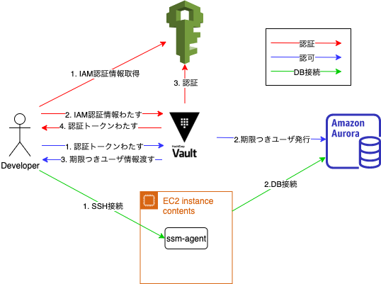
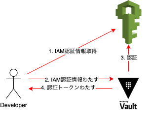
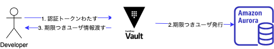
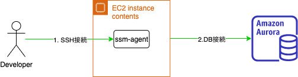

[Hamee Advent Calendar 2020 - Qiita](https://qiita.com/advent-calendar/2020/hamee)
の12日目の記事です。

## 本番DBの認証情報管理について

本番DBの認証情報の管理、みなさんどうしていますでしょうか？  
共有ユーザを作って、スプレッドシートでパスワードを管理するといった方も多いのではないでしょうか？  
この方法の問題点は以下にあります。

- スプレッドシートの閲覧権限を簡単に変更できるので、公開範囲が知らないうちに広がる可能性がある。
- 万が一漏洩した場合、本番DBのパスワード変更が必要になる。

これらの課題を解決するために、Vault + IAMを使い、期限つきDBユーザを使ったセキュアなDB接続の仕組みを作ってみました。

## Vaultについて

[Vault](https://www.vaultproject.io/)は、Terraformで有名なHashiCorp社が開発したプロダクトです。  
Vaultは機密情報を管理するためのソフトウェアです。  
任意の認証基盤(`auth`)と、任意の機密情報(`secrets`)への認可を組み合わせることができるのが特徴です。  
`auth`としては以下のようにGitHub,Azure,AWSなど様々なものが利用できます。

[auth](https://www.vaultproject.io/docs/auth)

`secrets`の方も、以下のように様々なものを指定できます。

[secrets](https://www.vaultproject.io/docs/secrets)

## 全体像

いきなりですが、全体像を最初にはっておきます。


以下で詳しく説明していきます。

## Vaultによる認証、認可(図の赤と青のところ)

今回作った仕組みでは、`auth`として[AWS](https://www.vaultproject.io/docs/auth/aws)を選択し、`secrets`として[MySQL(Aurora)](https://www.vaultproject.io/docs/secrets/databases/mysql-maria)を利用しました。  
通常の`secrets`だと、Vaultは認証が通ったユーザに対して、内部に保存した値をただ返すだけです。  
しかし、`MySQL(Aurora)`の`secrets`の場合、動的に期限つきDBユーザを作成し、そのユーザ名/パスワードを返すという機能があり、今回はこの機能を使っています。

認証、認可を図示すると、以下のようになります。

- 認証の仕組み



ユーザはAWSの認証情報(IAM Credentials)を設定した上で、vaultにログインします。

```bash
export AWS_ACCESS_KEY_ID="dummy"
export AWS_SECRET_ACCESS_KEY="dummy"
export AWS_SESSION_TOKEN="dummy"
vault login -method=aws role=db-read
```

vaultは該当のIAM Credentalsを持つユーザが存在するか、AWS IAMの設定を確認します。  
存在すれば認証OK、存在しなければ認証NGです。  
認証OKの場合、Vaultは認証トークンを発行します。
このトークンを使って`secrets`へのアクセスを行います。

- 認可の仕組み



認証が通ると認証トークンが発行されているので、それを使って期限つきDBユーザの払い出しを求めます。  
トークンは認証の際に自動的にローカルファイルに保存されているので、明示的に指定する必要はありません。

```bash
vault read production-db/creds/read
```

## SSMを使ったDB接続(図の緑のところ)

Vaultによって、IAMを使った認証が通ったユーザに期限つきDBユーザのユーザ名/パスワードを渡すことができました。

次に考えることはどうやってDBにつなげるか？です。
ここに関しては、SSMを使ったDB踏み台インスタンスを用意しました。



SequelProなどのGUIツールが使いたいという要望があったため、SSMではSSH接続を使っています。

SSMを使ったSSH接続のためにローカルの`~/.ssh/config`には以下の設定をします。

```conf
# SSH over Session Manager
host i-* mi-*
    ProxyCommand sh -c "PATH=$PATH:/usr/local/bin/ aws ssm start-session --region ap-northeast-1 --profile DBBastionAccess --target %h --document-name AWS-StartSSHSession --parameters 'portNumber=%p'"
```

この設定をしておくことで通常のサーバにSSHするのと同様に以下のようにSSHできます。

```bash
ssh -i ~/.ssh/hoge hoge@i-04378jeje
```

SSHユーザとSSHキーはEC2インスタンス起動時のユーザデータで設定しています。

```bash
#!/bin/bash
useradd hoge
mkdir -p /home/hoge/.ssh
chmod 700 /home/hoge/.ssh
echo 'ssh-rsa ABCDEFGHIJKLMNOPQRSTUVWXYZABCDEFGHIJKLMNOPQRSTUVWXYZABCDEFGHIJKLMNOPQRSTUVWXYZABCDEFGHIJKLMNOPQRSTUVABCDEFGHIJKLMNOPQRSTUVWXYZABCDEFGHIJKLMNOPQRSTUVWXYZABCDEFGHIJKLMNOPQRSTUVWXYZABCDEFGHIJKLMNOPQRSTUVABCDEFGHIJKLMNOPQRSTUVWXYZABCDEFGHIJKLMNOPQRSTUVWXYZABCDEFGHIJKLMNOPQRSTUVWXYZABCDEFGHIJKLMNOPQRSTUVABCDEFGHIJKLMNOPQRSTUVWXYZABCDEFGHIJKLMNOPQRSTUVWXYZABCDEFGHIJKLMNOPQRSTUVWXYZABCDEFGHIJKLMNOPQRSTUVABCDEFGHIJKLMNOPQRSTUVWXYZABCDEFGHIJKLMNOPQRSTUVWXYZABCDEFGHIJKLMNOPQRSTUVWXYZABCDEFGHIJKLMNOPQRSTUV' > /home/hoge/.ssh/authorized_keys
chmod 600 /home/hoge/.ssh/authorized_keys
chown hoge:hoge /home/hoge -R
```

## まとめ

3つの処理(認証、認可、DB接続)が必要なので手順が多いのが難点です。  
いい感じにラップしてくれるツールを今後作って行かなきゃなーと思っています。
あと、いずれはDB踏み台をFargate化したりしたいなーと考えています。
